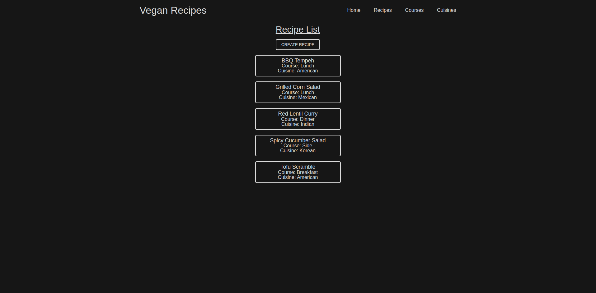

<h1>Vegan Recipes</h1>

This is a Vegan Recipe CRUD application developed using NodeJs, Express, Pug, Mongoose and MongoDB. You are able to view, create, update and delete your own recipes, courses and cuisines.

The MongoDB cluster created for the application contains 3 collections within the project database for recipes, courses and cuisines. All information is stored within the database when any documents within this collections are created, read, updated or deleted.

Give it a try here: https://frozen-brook-51539.herokuapp.com/cookbook/

  

## Author

👤 **Keffri Neal**

- LinkedIn: [@keffri](https://www.linkedin.com/in/keffri/)
- Github: [@keffri](https://github.com/keffri)
